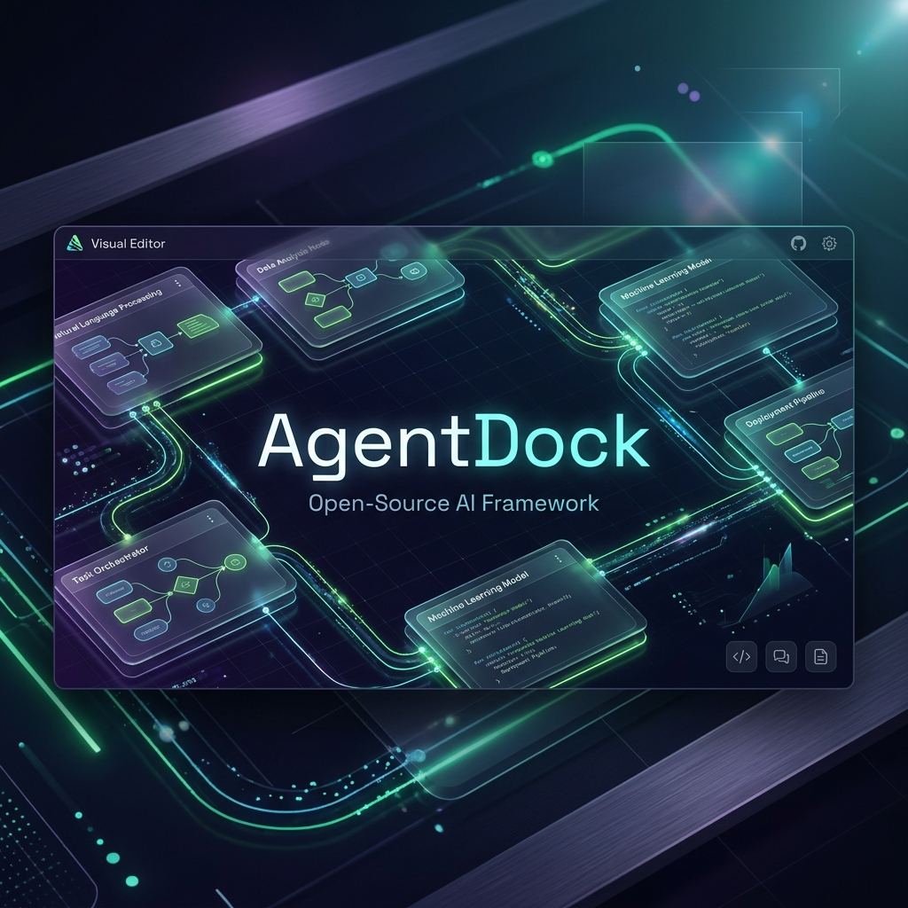
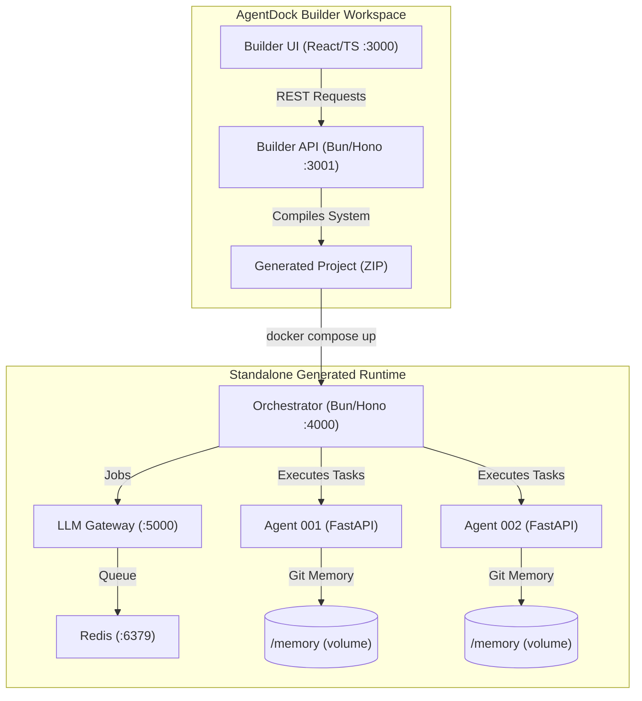

# AgentDock

[](https://opensource.org/licenses/MIT)
[](https://bun.sh/)
[](https://www.docker.com/)

<p align="center">
  
</p>

**AgentDock** is an open-source visual pipeline generator and runtime for complex multi-agent workflows. It allows you to describe any multi-agent system in plain English, generates a visual agent graph, configures each agent with specific system prompts, temperatures, and tools, and exports a self-contained, standalone Docker Compose project that runs independently.

---

## 📖 Table of Contents
- [The Problem & The Solution](#-the-problem--the-solution)
- [Key Concepts](#-key-concepts)
- [System Architecture](#%EF%B8%8F-system-architecture)
- [🚀 Quick Start](#-quick-start)
- [📂 Documentation Directory](#-documentation-directory)
- [🛠️ Technology Stack](#%EF%B8%8F-technology-stack)
- [⚖️ License](#%E2%9A%96%EF%B8%8F-license)

---

## 💡 The Problem & The Solution

When AI-powered conversational systems grow large, they suffer from **context collapse**. Long conversations fill the context window, causing models to hallucinate, repeat instructions, and lose track of previous user state.

**AgentDock solves this by building modular pipelines of specialized agents.** Instead of running a single conversational loop, AgentDock splits tasks across multiple containerized, single-purpose agents (e.g., a teacher, a quiz master, and a profile evaluator). Agents coordinate by reading and writing files and pass state forward. Long-term user profiles are committed directly to a Git-backed Docker volume, automatically feeding relevant context back into subsequent runs via semantic RAG search.

---

## 🎯 Key Concepts

### 1. The Builder Workspace
A React Flow visual canvas that lets you edit agent graphs. Using a natural language prompt, you can describe a system (e.g., *"A math tutor that quizzes students and updates their profiles"*), and the builder compiles it into nodes, prompts, connections, and tools. 

### 2. The Generated Runtime
A standalone, self-contained Docker Compose project exported by the builder. The generated workspace contains its own API gateway, message broker, Redis job queue, and FastAPI python containers. Once exported, it runs on any machine with Docker without depending on the Builder.

---

## ⚙️ System Architecture

AgentDock cleanly divides the design phase from the execution phase. Below is a high-level overview of how they interact:



---

## 🚀 Quick Start

### 1. Clone and Configure
```bash
git clone https://github.com/BlackPool25/AgentDock.git
cd AgentDock
cp .env.example .env
```

Open `.env` and fill in:
- `JWT_SECRET` (at least 32 characters)
- `ADMIN_PASSWORD` (for the dashboard login)
- `LLM_PROVIDER` (e.g., `groq`, `openai`, `anthropic`, or `ollama`)
- `LLM_MODEL` (e.g., `llama-3.1-70b-versatile`, `gpt-4o-mini`)
- Corresponding API keys (e.g., `GROQ_API_KEY`)

### 2. Start the Builder
```bash
docker compose -f docker/builder.docker-compose.yml up -d
```
Navigate to `http://localhost:3000` and sign in with `admin@agentdock.local` and your configured password.

---

## 📂 Documentation Directory

To keep documentation clean and maintainable, AgentDock's user guides are divided into separate, specialized files:

- **[System Architecture](docs/architecture.md)** — Deep dive into the internal components of the Builder and Standalone Runtime, including the agent generation pipeline rules.
- **[Development & Extension Guide](docs/development.md)** — Instructions for local development, workspace setups, monorepo directory structures, and the builtin agent tools.
- **[API Reference Guide](docs/api-reference.md)** — Detailed specification of all Builder API REST endpoints and Runtime WebSocket event schemes.
- **[Model Context Protocol (MCP) Registry](docs/mcp-registry.md)** — Explanations and lists of the 52 pre-wired and optional Model Context Protocol servers.
- **[Hardening & Bug Fixes](docs/hardening.md)** — Historic engineering bug reports and resolutions regarding container memory locks, config loader patches, and chunker fixes.

---

## 🛠️ Technology Stack

| Component | Technologies |
|---|---|
| **Builder UI** | React, TypeScript, Vite, Tailwind CSS, React Flow, Zustand |
| **Builder API** | Bun, Hono, Drizzle ORM, SQLite |
| **Runtime Orchestrator** | Bun, Hono, Dockerode, Croner |
| **Runtime LLM Gateway** | Bun, Hono, BullMQ, Redis |
| **Agent Base Image** | Python, FastAPI, uv |
| **Agent Memory Store** | Markdown, local Git (per-agent Docker volumes) |
| **Agent RAG Indexer** | ChromaDB, sentence-transformers (offline) |

---

## ⚖️ License

Distributed under the MIT License. See [LICENSE](LICENSE) for details.
