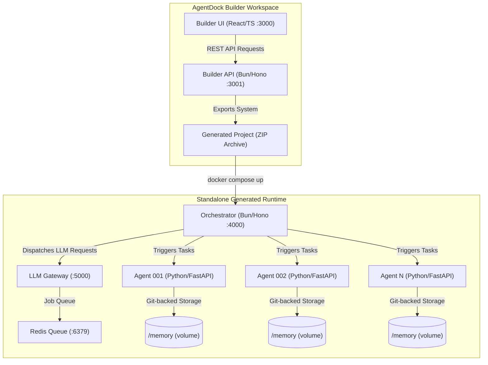

# AgentDock Architecture

AgentDock uses a decoupled architecture divided into two main layers: the **Builder Workspace** and the **Standalone Generated Runtime**. 

---

## Architecture Overview

---

## 1. The Builder Workspace

The Builder is a local workspace where you define, design, and configure your multi-agent pipelines. It has two main sub-components:

### Builder UI (`apps/builder-ui`)
A premium, responsive React web application.
- **Visual Canvas:** Built with React Flow and Zustand for intuitive visual assembly of agents, connections, and file-trigger workflows.
- **Describe Bar:** A natural language interface that lets you describe a workflow (e.g., in English) and converts it into a full agent pipeline.
- **Patch Mode:** Modify specific nodes or agent prompts without regenerating the entire system.
- **Export Control:** Compiles the system configuration and generates a downloadable standalone ZIP archive.

### Builder API (`apps/builder-api`)
A high-performance backend server powered by Bun and Hono.
- **System CRUD:** Manages SQLite database state for saved system designs.
- **Phase 1: Intent Analysis:** Parses natural language descriptions, extracts intent metrics (pipeline type, user state tracking, namespacing), and designs the agent hierarchy.
- **Phase 2: Per-Agent Generation:** Independently crafts prompts, settings, temperature, and specific inputs/outputs for each agent.
- **Zip Compilation:** Packages the runtime template, customized orchestrator config, agent configuration files, and Compose schema into a single deployable ZIP.

---

## 2. The Standalone Generated Runtime

When you export a system from AgentDock, you get a self-contained project. Running `docker compose up` starts a dedicated cluster of services:

### Runtime Orchestrator (`apps/orchestrator`)
An event-driven gateway that directs workflow execution:
- **Webhook Gating:** Exposes secure, public webhook endpoints (`/webhooks/:agent-id`) to kick off pipelines from external integrations.
- **WebSocket Broadcasts:** Sends live logs, status changes, and task activity to listening dashboards.
- **Task Scheduling & Routing:** Parses `configs/workflow.yaml` to trigger downstream agents sequentially based on output file updates.

### LLM Gateway (`apps/llm-gateway`)
A unified API gateway and load balancer for inference:
- **Job Queuing:** Uses BullMQ and Redis to queue and prioritize inference calls, preventing API rate limits from breaking workflows.
- **Provider Registry:** Supports OpenAI, Anthropic, Gemini, Groq, and Ollama out of the box.

### Agent Runtime (`apps/agent-runtime`)
The containerized base image for all generated agents (built with Python & FastAPI):
- **FastAPI Endpoint:** Receives execution instructions, resolves prompt placeholders, and runs the agent loop.
- **Builtin Tools:** Access to sandboxed command execution, web search, and URL fetching.
- **MCP Client:** Extends agent capabilities by connecting to external Model Context Protocol stdio servers.

### Git-Backed Memory & Embedded RAG
- **State Serialization:** Agent execution metadata and profiles are stored as standard Markdown files.
- **Git Commit Safety:** All profile/memory edits are automatically committed to a local git repository on a dedicated Docker volume. A queue-based lock mechanism prevents race conditions on concurrent writes.
- **Markdown-Aware RAG:** Sections are indexed into an embedded ChromaDB vector store. Retrieval splits on markdown headers first to preserve semantic structure.

---

## 3. Agent Generation Quality Rules

AgentDock maintains strict generation standards to produce production-grade code. The build pipeline operates in two distinct phases:

### Phase 1 — Intent Analysis
Extracts structure at a low temperature (0.1) for high structure accuracy. It determines:
- Pipeline topology (e.g., Linear, Router, Directed Acyclic Graph).
- User state tracking needs (single-user vs. multi-user).
- File flow contracts (guaranteeing file inputs/outputs align correctly).

### Phase 2 — Per-Agent Prompting
Generates each agent configuration file independently using strict formatting rules defined in `apps/builder-api/src/api/routes/agent-rules.ts`. Key guidelines include:
- **Single Responsibility:** Each agent does exactly one job.
- **System Prompt Integrity:** Prompts explicitly declare inputs, expected output file format, permitted tools, and RAG boundaries.
- **Task-Specific Temperature:** 0.1 for high-accuracy classification/scoring, 0.3 for retrieval/synthesis, 0.6 for creative writing.
- **Strict Webhook Mappings:** Maps webhook payloads directly to template variables using the `{{input.userId}}` syntax.
