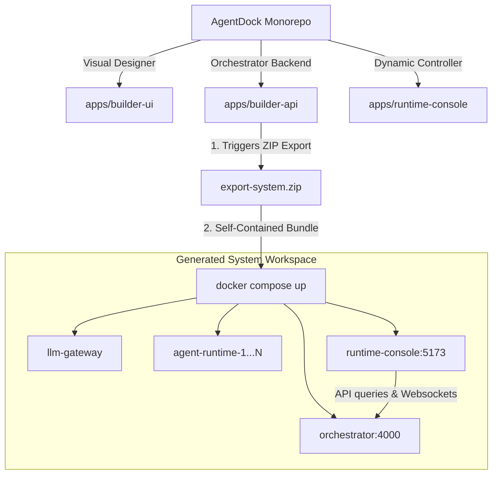

# AgentDock Console Interface Architecture & Integration Walkthrough

This document outlines the clear architectural roles, routing mechanics, and integration details of the two frontend interfaces within the **AgentDock** ecosystem.

---

## 🗺️ Interface Directory Mapping

| Workspace Path | Interface Role | Build System | Target Audience / Usage |
| :--- | :--- | :--- | :--- |
| `apps/builder-ui/` | **AgentDock Builder Canvas** | React + Vite + Tailwind CSS v4 | **Main Platform UI:** Used by users to visually design, describe in natural language, and configure multi-agent networks. Exposes ports `3000`/`3001` locally. |
| `apps/runtime-console/` | **Generated System Console** | React + Vite + Tailwind CSS v4 | **Exported Runtime UI:** Automatically bundled inside generated system ZIP archives. Exposes a live dashboard at port `5173` to manage and monitor a running system's logs, memory files, and tasks. |

---

## 🏗️ Monorepo & Docker Build Architecture



### 📦 Docker Context Adjustments
To ensure both the builder stack and dynamic system exports build successfully in all virtual environments, we updated both builder Dockerfiles to register the `@agentdock/runtime-console` workspace dependencies:

1. **`apps/builder-api/Dockerfile`**: Added package copy steps and source directory mappings:
   ```dockerfile
   COPY apps/runtime-console/package.json ./apps/runtime-console/
   COPY apps/runtime-console/ ./apps/runtime-console/
   ```
2. **`apps/builder-ui/Dockerfile`**: Added package copy steps:
   ```dockerfile
   COPY apps/runtime-console/package.json ./apps/runtime-console/
   ```

---

## ⚡ Dynamic Runtime Discovery & Profile Seeding

To keep the console fully decoupled from specific hackathon agent designs, the interface uses two main dynamic hooks:

1. **Topology Discovery (`/api/system/topology`)**:
   Instead of hardcoding nodes, the console maps coordinates, node sizes, trigger rules, and connections directly from the Orchestrator configuration loaded at boot.
   
2. **Dynamic Entrypoint Resolving**:
   When dispatching instructions from the chat prompt, the console dynamically isolates the entrypoint of the active topology (identifying the agent with zero incoming edge connections) and fires the trigger webhooks specifically to that agent.
   
3. **Targeted Profile Seeding**:
   The default context-seeding payload (`PUT /api/agents/{agentId}/memory/profiles/admin.md`) is dispatched dynamically to the resolved entrypoint agent instead of targetting a hardcoded identifier.

---

## 🧪 Build & Type-Safety Verification

To certify the monorepo configuration, we executed global linting and build validation sweeps:

*   **Workspace Dependency Resolution**: Resolved by renaming the package metadata in `apps/runtime-console/package.json` to `@agentdock/runtime-console` and updating `bun.lock`.
*   **Compilation Verification**: `bun run typecheck` completed with **exit code 0** across all workspaces:
    *   `@agentdock/runtime-console` (TypeScript / Vite / React)
    *   `@agentdock/builder-api` (TypeScript / Bun / Hono)
    *   `@agentdock/builder-ui` (TypeScript / Vite / React)
    *   `@agentdock/shared-types`
    *   `@agentdock/config-schema`
*   **Docker Integration**: Successfully built images for both `docker-builder-ui` and `docker-builder-api` without caching errors.
