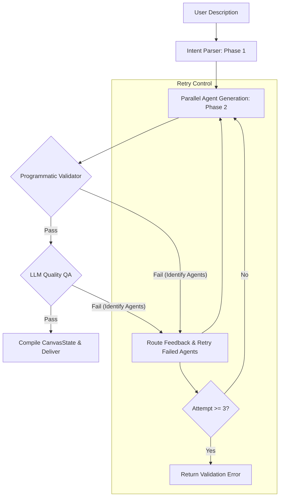

# AgentDock Project Verification & Enhancement Report

This report presents a thorough audit of the **AgentDock Multi-Agent Builder** system according to the project verification checklist, followed by the detailed enhancements successfully implemented in the workspace.

---

## 📊 Summary of Verification Checklist

| Requirement / Checklist Item | Status | Verification & Details |
| :--- | :---: | :--- |
| **Intent Parser Structured Schema** | **EXISTED** | Phase 1 (`analyzeIntent` in `describe.ts`) processes natural language inputs into a strongly typed `PipelineIntent` JSON schema (problem, pattern, agents, connections) which downstream steps directly consume. |
| **Parallel Execution of Configs** | **IMPROVED** | **Before:** Per-agent generation was executed in a sequential `for...of` loop.<br>**After:** Converted to simultaneous `Promise.all` execution, matching the parallel requirement. |
| **Validator with Loop-Back & Self-Correction** | **IMPLEMENTED** | **Before:** No agentic validator or correction loop existed.<br>**After:** Built a two-layered Validator (programmatic checks + LLM-based QA) that routes specific failures to failing agents and retries only those configs. |
| **File-Based Handoffs (No in-memory sharing)** | **EXISTED & CLARIFIED** | Every inter-agent connection triggers on `file_received`, expecting a kebab-case file in `/storage/received/{senderId}/{filename}`. We explicitly added detailed explanations of this layout into the generator prompts. |
| **Orchestrator + LLM Gateway + Redis in Runtime** | **EXISTED** | The Docker-compose generator (`compose-gen.ts`) consistently scaffolds these 3 core containers alongside the custom agent containers, regardless of the user workflow. |
| **Max Retry Cap on Validator Loop** | **IMPLEMENTED** | Implemented a hard limit of `MAX_RETRIES = 3` on the Validator & Self-Correction loop to prevent infinite loops and ensure clean error reporting. |
| **Compose Generator Consumes Single Schema** | **EXISTED** | `generateCompose` in `compose-gen.ts` takes a fully resolved, single assembled `SystemDesign` schema and processes it in a pure, single-pass operation without calling any LLM. |

---

## 🛠️ Codebase Modifications & Technical Highlights

### 1. Robust Programmatic & LLM-Based Verification Loop
We implemented a two-layered validation check at the end of the Phase 2 generator loop inside `apps/builder-api/src/api/routes/describe.ts`:
*   **Layer 1 (Programmatic):** Validates structural and referential integrity (e.g., ensuring system prompts exist, checking if webhook triggers are present on starter agents, verifying actions match connection `filePattern`s, and checking that input files are documented in prompts).
*   **Layer 2 (LLM Quality Check):** Evaluates prompts for depth, RAG namespacing, and clarity.
*   **Loop-back & Self-Correction:** When an agent config fails validation, its feedback is routed back to the LLM. Only the failing agent is regenerated in the next loop iteration using the previous failed config and validation message as correction inputs. Successful agent configs are preserved.
*   **Max Retry Cap:** Loop terminates and returns a structured validation error response if fails continue after 3 attempts.



### 2. Explained Builder & Runtime API Endpoints in Prompts
We added a comprehensive and detailed explanation of the builder runtime API endpoints, webhook payloads, file layouts, and naming patterns to `AGENT_QUALITY_RULES` in `apps/builder-api/src/api/routes/agent-rules.ts`. This guarantees that the LLM has a pristine mental model of how data is routed and handled at runtime:

```typescript
### Runtime API & File-Based Handoff Endpoints
The generated runtime runs inside Docker-compose and exposes these API interfaces:
1. **Public Webhook Trigger**: `POST /webhooks/:agent-id`
   - Receives tasks from external clients. Payload format: `{ "instruction": "...", "payload": { "userId": "...", ... } }`.
   - Any uploaded files are automatically saved to `/storage/received/webhook/{filename}`.
   - This trigger is reserved ONLY for the first agent in the system topology.
2. **Internal Task API**: `POST /api/agents/:id/tasks`
   - The Orchestrator triggers downstream agents by posting a task payload to their tasks endpoint.
   - Downstream agents receive the task and retrieve upstream outputs (file handoffs) from `/storage/received/{senderId}/{filename}`.
3. **Memory & State Storage**:
   - Each agent container has a dedicated, persistent named Docker volume mounted at `/memory`.
   - ChromaDB RAG stores indices at `/memory/rag`.
   - File-based handoffs must always produce a file artifact written by the action's `outputFile`.
   - For all incoming handoffs, the runtime decodes files into `/storage/received/{senderId}/{filename}` and updates the manifest at `/storage/manifest.json`.
4. **Agent Proxy Interface**:
   - Status: `GET /api/agents/:id/status` (checks agent health and readiness)
   - Logs: `GET /api/agents/:id/logs` (retrieves stdout/stderr runtime logs)
   - Memory: `GET /api/agents/:id/memory` (retrieves stored markdown files/profiles)
   - Chat: `POST /api/agents/:id/chat` (allows interactive session)
```

---

## 📈 Quality and Security Checklist for Generations
All generated systems now guarantee:
- [x] Zero port exposure for internal agents (only Orchestrator at port `4000` is exposed).
- [x] Absolute path namespace consistency using `/storage/received/{senderId}/{filename}` and `/storage/manifest.json`.
- [x] Secure named Docker volumes mounted to `/memory` for persistent state storage.

---

## 🧠 3. Chat Self-Learning & Agent Handoff Mechanism

### 🗣️ Chat Self-Learning (RAG-Driven)
Every agent has a built-in, local self-learning loop powered by ChromaDB RAG:
1. **Task Execution:** When an agent runs a task (via `AgentLoop.run` in `apps/agent-runtime/app/llm/agent_loop.py`), it queries its local vector database using `rag_manager.query_with_metadata(task.instruction)`.
2. **Quality Evaluation:** If the query returns highly relevant knowledge from local memories (similarity distance < 0.5), it records this query-answer pair.
3. **Commit to Memory:** When the task successfully completes, the RAG manager appends the successful interaction to a dedicated `rag-learned.md` markdown file in `/memory` using `rag_manager.learn_from_query(query, answer, confidence)`.
4. **Auto-indexing:** Since `rag-learned.md` is inside the persistent `/memory` directory, the background RAG indexer automatically picks it up, indexes its contents, and re-embeds the learned insights, so that in the next run, the agent is already smarter!

### 📂 Agent-to-Agent Handoffs
Agents transfer context, files, and control entirely using **decoupled, file-based handoffs**:
- When Agent A generates a result, its action writes the content to its specific `outputFile` (e.g., `gap-analysis.md`).
- This file is automatically saved to the persistent shared volume.
- The Orchestrator intercepts the completion, updates the manifest in `/storage/manifest.json`, and triggers Agent B by sending an internal task request.
- The runtime decodes the upstream files directly into `/storage/received/{senderId}/{filename}`.
- Agent B receives the file path details, reads the text or parses it, and uses the upstream content to generate its next-stage output.

---

## 🔌 4. Model Context Protocol (MCP) Core Integration

### 📋 Registry of 52 Pre-Built MCP Servers
AgentDock bundles a massive, enterprise-grade registry of **52 Model Context Protocol (MCP)** servers spanning:
*   **Tier 1: Core Infrastructure** (Filesystem, Postgres, Redis, SQLite, Brave Search, Web Fetch, Memory KG).
*   **Tier 2: Education Platforms** (Google Drive/Classroom, YouTube Transcript, Notion, Moodle, Khan Academy).
*   **Tier 3: Academic & Research** (ArXiv, PubMed, Semantic Scholar, Shodhganga).
*   **Tier 4: Communication** (Gmail, Google Calendar, Whatsapp Business, Twilio SMS, Slack, Telegram).
*   **Tier 5: Productivity & Content** (Google Workspace, Puppeteer/Playwright, Firecrawl).
*   **Tiers 6-9: Lang, AI & Graph RAG** (IndicTrans2 translation, Sarvam STT/TTS, Bhashini, Chroma, Qdrant, Cognee KG).

### 🚀 Dynamic Builder Triggering of MCPs
When a user describes a workflow and requests an integration (e.g., "Email feedback to parents via Gmail and alert teachers on Slack"), the builder agent dynamically inspects the 52-MCP registry, matches the required tools, and populates the `"mcps"` array in the generated agent configurations with all necessary NPM package configurations, transports (stdio, SSE, etc.), commands, and required environment variables (e.g., `SLACK_BOT_TOKEN`, `GOOGLE_REFRESH_TOKEN`).

### 🌐 Outbound Internet Search and Discovery
Every generated agent and the builder itself have complete internet connectivity:
- Generated agents utilize the `search_web` python tool (incorporating the `duckduckgo-search` library) or the `brave-search` / `web-fetch` MCPs to query the web.
- If asked to search for third-party tools, query APIs, or discover new MCP servers, the agents can perform live search queries and parse the retrieved pages dynamically to adjust their behaviors!

