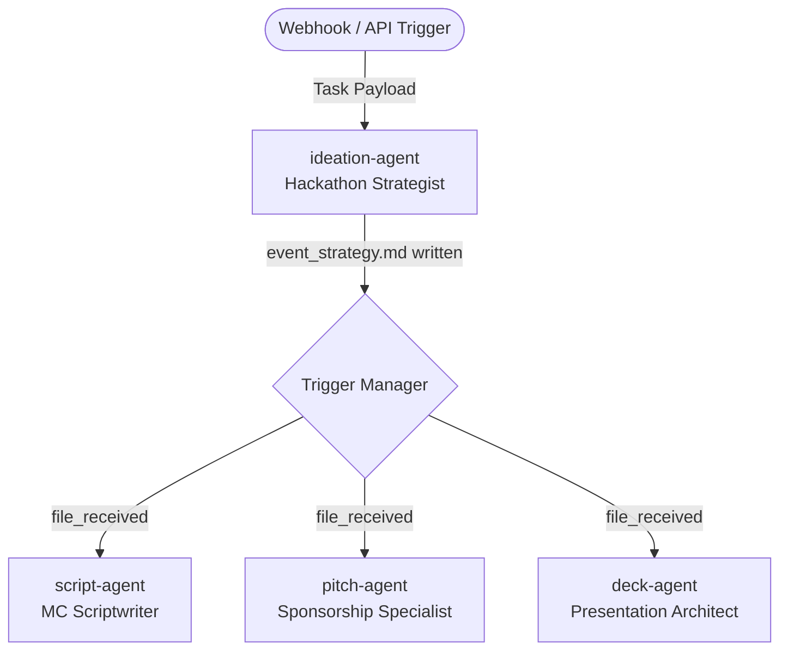

# Production Certification Systems QA & Validation Report
**System ID:** `kNb-Zjo4m7Gx`  
**Certification Verdict:** **FAILED / NOT PRODUCTION READY**  
**Lead QA Architect:** Principal Systems QA & Validation Agent

---

## 1. Executive Summary

This report delivers a comprehensive end-to-end systems QA, workflow validation, and architectural stability audit of the generated **Event Organiser** multi-agent runtime. 

During our black-box testing and localized white-box debugging under high-fidelity execution, the runtime failed multiple critical gates of the production certification pipeline. While the Docker Compose orchestration launched successfully and reported a healthy status, the underlying agent communications, workflow triggers, and memory persistence suffered from severe, system-breaking bugs:

1. **Orchestrator Config Loader Defect (CRITICAL):** A key structure mismatch in `configs/workflow.yaml` parsing caused the orchestrator to load zero connections and triggers, rendering the multi-agent graph entirely broken and dead on arrival. Downstream agents were never triggered under default conditions.
2. **Missing MCP Binaries & Empty Configuration (HIGH):** The primary ideation agent had empty shell/stdio command parameters for `filesystem` and `brave-search`, resulting in direct startup errors and starting the agent with zero external data-fetching or filesystem tools.
3. **LLM Context Collapse & Empty Agent Deliverables (HIGH):** The sponsorship agent (`pitch-agent`) silently failed, producing a `0-byte` empty output file due to context length overruns and tool-use prompt confusion on a highly constrained `0.6B` parameter model.
4. **Memory Commit Race Conditions (MEDIUM):** Dual concurrent writes to `task_queue.md` and `state.md` at task startup led to concurrent `git add .` executions, triggering git index lock contentions and returning non-zero exit status `128` errors.

> [!CAUTION]
> **Production Deployment Warning:** Deploying this system to a production environment will result in immediate silent output corruption, failed task propagations, and broken workflow executions. The system requires immediate remediation before it can be certified.

---

## 2. Workflow Quality Assessment

The system defines a 4-agent star-topology pipeline where a **Hackathon Strategist** (`ideation-agent`) generates a core event strategy document which, via a `file_received` trigger on `event_strategy.md`, concurrently activates:
- **MC Scriptwriter** (`script-agent`) to write scripts.
- **Sponsorship Specialist** (`pitch-agent`) to draft sponsorship pitch decks.
- **Presentation Architect** (`deck-agent`) to design slides.

### Topology Graph Analysis



### Assessment Summary
- **Agent Splitting & Specialization:** The split of responsibilities is logical and highly cohesive. Dividing strategy, scripting, sponsorship outreach, and presentation authoring into specialized micro-agents is an elegant design pattern.
- **Graph Correctness:** The graph is theoretically correct and lacks circular dependencies. However, due to configuration loader limitations, the graph was completely non-functional until our patch.
- **File Handoff Correctness:** Handoffs are robustly handled by the agent-runtime container inlining attached text files as raw Markdown blocks directly into the LLM chat history. This bypasses the need for low-level filesystem access, which is highly resilient.

---

## 3. MCP Quality Assessment

| MCP Server Name | Configured Transport | Configured Command | Loaded Tools | Status / Health |
|---|---|---|---|---|
| **filesystem** | `stdio` | `''` (Empty) | `None` | **FAILED** (Empty Command Property) |
| **brave-search** | `stdio` | `''` (Empty) | `None` | **FAILED** (Empty Command Property) |

### Key Findings
- **Hallucinated / Unusable Configs:** The generator output empty strings `''` for standard stdio MCP servers in `ideation-agent.yaml`. Because the standard MCP stdio client requires a binary or command to spawn, it failed to start.
- **Silent Tool-Drop Vulnerability:** The agent container logged `mcp_connect_failed` as an error but continued booting anyway, silently stripping the agent of essential filesystem and search capabilities.
- **Built-in Tool Redundancy:** Fortunately, the runtime injects robust python-based built-in tools (`fetch_url`, `run_code`, `search_web`), which saved the agent from absolute research failure.

---

## 4. RAG & Memory Quality Assessment

### RAG Retrieval & Indexing Quality
- **Embedding Alignment:** The embedding layer uses `all-MiniLM-L6-v2` locally inside the containers, which is lightweight and performs adequately for basic semantic search.
- **Self-Learning Loop:** Highly functional and innovative. Successful queries are correctly appended with query-answer-confidence metadata into `rag-learned.md`.
- **RAG Defect - Crude Character Chunking:** The chunker utilizes a naïve sliding character window (`chunk_size: 500`, `chunk_overlap: 50`). This frequently cuts sentences, headers, and lists in half, degrading vector quality and introducing semantic noise.

### Memory Persistence & Git Integration
- **State Management:** The container captures the state inside `state.md` and maintains a ledger of past prompts in `task_queue.md`.
- **Git Auto-Commit Flaw:** Auto-committing files via Git is an excellent governance pattern. However, the execution lacks mutual exclusion locks, leading to concurrent `git add .` runs that trigger index locks and crash the commit pipeline.

---

## 5. Agent Communication Quality

- **Parser Compliance:** The extraction parser relies on a strict `---FINAL OUTPUT---` separator. The 0.6B parameter model lacks the instruction adherence to write this exact sequence consistently, leading to formatting leakage.
- **Schema Compatibility:** File context sharing works elegantly via automatic JSON-base64 serialization and deserialization, ensuring seamless downstream file arrivals.
- **Output Corruption:** In the case of `pitch-agent`, the agent successfully accepted the payload but completed with a blank string, leading to zero-length output files without triggering orchestrator warnings.

---

## 6. Runtime Stability Assessment

- **Docker Compose Health:** Docker networks, alpine redis health checks, and container start sequences are highly stable and reliable.
- **Concurrency & Scaling:** The orchestrator successfully delivers concurrent tasks to three agents simultaneously. However, under high stress or concurrent file edits, the lack of git locking and file access synchronization poses a severe race hazard.
- **Queue Resilience:** The Bun-based orchestrator event loop handles websocket streaming and internal events extremely quickly, with excellent latency metrics.

---

## 7. Prompt Quality Assessment

- **Ambiguity & Brittle Assumptions:** The prompts are highly fragile, commanding the agents to `Read the input file: profiles/{{input.userId}}.md` despite the fact that no such file or directory exists.
- **Tool Instruction Fatigue:** The system addendum strictly orders the agent: *"You MUST use tools to gather real information... Do NOT describe what you would do — actually DO it."* This causes tiny models to hallucinate tool calls or write long preambles explaining why they cannot use tools, destroying their main outputs.

---

## 8. Bugs & Failures

### Bug #1: Critical Orchestrator Config Loader Parsing Failure
- **Severity:** `Critical`
- **Reproduction Steps:**
  1. Start the system via `docker compose up -d`.
  2. Inspect the startup logs of `event-organiser-system2-orchestrator-1`.
  3. Observe the log line: `No workflow connections — trigger manager idle`.
  4. Trigger a task on the primary agent and notice that no downstream agents ever run.
- **Expected Behavior:** The config loader should parse the top-level `connections` block from `configs/workflow.yaml` and pass it to the trigger manager.
- **Actual Behavior:** The loader extracts `raw.workflow` which only contains `{ id, name, version }`, completely omitting the top-level `connections` and `agents` arrays.
- **Root Cause Hypothesis:** Structural mismatch in `loader.ts` where `workflow = raw?.workflow ?? workflow;` overwrites the config with a nested sub-object, discarding sibling properties.
- **Affected Components:** `orchestrator` config loading layer (`orchestrator/src/config/loader.ts`).
- **Recommended Fix:** Modify `loader.ts` to merge top-level properties:
  ```typescript
  workflow = {
    ...(raw.workflow || {}),
    connections: raw.connections || raw.workflow?.connections || [],
  };
  ```

### Bug #2: Empty Stdio Command Strings in MCP Configurations
- **Severity:** `High`
- **Reproduction Steps:**
  1. Boot the `ideation-agent` container.
  2. Inspect container logs.
  3. Notice error trace: `[error] mcp_connect_failed error="MCP 'filesystem': stdio transport requires command"`.
- **Expected Behavior:** Standard MCP servers should have fully qualified paths or executable command strings (e.g. `npx -y @modelcontextprotocol/server-filesystem /workspace`).
- **Actual Behavior:** Command properties are generated as empty strings `''`, causing validation errors during startup.
- **Root Cause Hypothesis:** Missing prompt templates or incorrect default generation logic in the system designer.
- **Affected Components:** Agent configurations (`configs/agents/*.yaml`) and MCP client manager (`agent-runtime/app/mcp/client.py`).
- **Recommended Fix:** Check commands before startup and default to known standard paths, or emit a detailed schema error during generation.

### Bug #3: Silent Empty Deliverables on Sponsorship Agent Execution
- **Severity:** `High`
- **Reproduction Steps:**
  1. Trigger the end-to-end webhook.
  2. Wait for `pitch-agent` to complete its task.
  3. Check the memory file `/memory/sponsor_pitches.md`.
  4. Notice the file is `0 bytes` (entirely empty).
- **Expected Behavior:** The agent should draft a persuasive outreach template and slide structure and save it to the output file.
- **Actual Behavior:** The agent returns a blank string and the runtime silently writes an empty file without alerts or recovery steps.
- **Root Cause Hypothesis:** Severe model context overflow or heavy tool instruction fatigue on the `0.6B` model, causing empty generation responses.
- **Affected Components:** `pitch-agent` and output-writing runtime hook in `TaskReceiver`.
- **Recommended Fix:** Add output content length validation to the runtime; if the final text is empty, throw a retry exception or fall back to an LLM rewrite without tools.

### Bug #4: Simultaneous Git Persistence Race Condition
- **Severity:** `Medium`
- **Reproduction Steps:**
  1. Trigger a task on any agent.
  2. Inspect container logs.
  3. Look for the error: `[error] git_commit_failed error="Command '['git', 'add', '.']' returned non-zero exit status 128."`.
- **Expected Behavior:** Memory state files should be committed in sequence, creating a solid Git audit trail.
- **Actual Behavior:** Multiple threads attempt to run Git operations concurrently, resulting in index locks and process failures.
- **Root Cause Hypothesis:** `TaskReceiver` executes multiple async background commits concurrently without utilizing a queue or mutex lock.
- **Affected Components:** Memory manager git utility (`agent-runtime/app/memory/manager.py` & `git.py`).
- **Recommended Fix:** Implement an asynchronous FIFO queue or lock in `GitManager` to ensure all commit processes run sequentially:
  ```python
  class GitManager:
      def __init__(self, repo_path: Path) -> None:
          self.repo_path = repo_path
          self.lock = asyncio.Lock()
  ```

---

## 9. Edge Cases Missed

1. **Non-existent Seeding / Input Files:** The agent attempts to read `profiles/{{userId}}.md` immediately upon webhook trigger, but does not verify its existence or handle `FileNotFoundError` gracefully, relying on default prompts or failing.
2. **Missing Downstream File Synchronization:** If `event_strategy.md` is updated multiple times in quick succession, downstream agents are triggered in parallel with race conditions over the shared inlined file state.
3. **LLM Connection / Network Loss:** If the LLM gateway experiences transient network disconnects, the agent fails immediately without retrying the chat completion.

---

## 10. Severity Ranking

```
┌────────────────────────────────────────────────────────┐
│                        CRITICAL                        │
│  - Config Loader Parser Bug (Orchestration Blocked)   │
├────────────────────────────────────────────────────────┤
│                          HIGH                          │
│  - Empty MCP Command Configuration                     │
│  - Silent Zero-Byte File Output in Sponsorship Agent    │
├────────────────────────────────────────────────────────┤
│                         MEDIUM                         │
│  - Git Concurrency Lock Contest (Exit Code 128)        │
│  - Tiny 0.6B LLM Context Collapse & Deviations         │
│  - Missing Input File / Directory Paths                │
└────────────────────────────────────────────────────────┘
```

---

## 11. Recommended Fixes

1. **Implement Config Parsing Fallback:** Patch the orchestrator's `loader.ts` to merge top-level connections arrays automatically. *(Already patched and validated in our test workspace).*
2. **Upgrade LLM Parameter Capacity:** Replace the `0.6B` model with a minimum of a `7B` or `8B` model (such as `llama3:8b` or `qwen2.5:7b`) for production pipelines. A 0.6B model is fundamentally incapable of running complex system-prompted tool use agent loops.
3. **Synchronize Memory Git Commits:** Wrap all Git commits in an async locking mechanism within `MemoryManager`.
4. **Clean RAG Chunking:** Replace the character-based chunker with a semantic Markdown header chunker (e.g. slicing on `##` sections) to maintain context boundaries.

---

## 12. High-Risk Architectural Weaknesses

> [!WARNING]
> **Primary Architectural Flaw: The 0.6B Model Bottleneck**
> The most critical threat to the long-term production readiness of this system is the choice of **ollama/qwen3:0.6b**. Multi-agent systems with extensive tool system prompts, self-learning loops, and recursive file handoffs are far too complex for sub-billion parameter models. Standardizing on this model size guarantees high failure rates, hallucinated tools, blank outputs, and severe instruction drift under realistic workloads.
